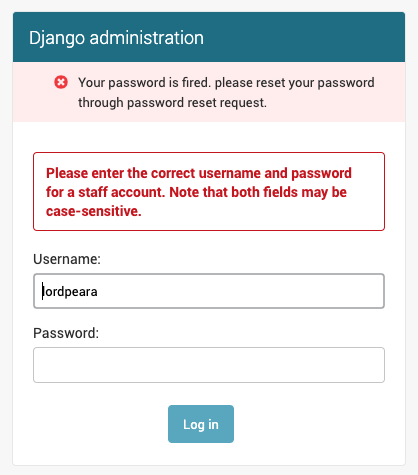

.. django-fire documentation master file, created by
   sphinx-quickstart on Fri Jun 26 22:34:29 2020.
   You can adapt this file completely to your liking, but it should at least
   contain the root `toctree` directive.

django-fire
===========

`django-fire <https://github.com/lordpeara/django-fire/>`_
if a toolbox to remove users password.

Maybe you are an administrator for django service and haved noticed an incident,
such as password exposure or cracking password hash algorithms (pbkdf2, bcrypt, etc.)

You can use this project to clean these vulnerable passwords.

Quick Instructions
------------------

.. code-block:: bash

    $ pip install django_fire

.. code-block:: python

    INSTALLED_APPS = [
        'django_fire',
        # ...
    ]

.. code-block:: bash

    $ python manage.py firepassword --all

You can remove all your users' password just in 5 minutes.

After invalidating passwords
----------------------------

After removing passwords, logins from users will always fails.

We provide auth backends to notice users that "your password is invalidated"

.. code-block:: python

    AUTHENTICATION_BACKENDS = [
        'django.contrib.auth.backends.ModelBackend',
        'django_fire.backends.FiredPasswordBackend',
    ]

If user try to login, user see messages like below.

